# 🧪 Testing Infrastructure for Tmux Persistent Console

> Automated testing infrastructure using Oracle Cloud Free Tier

## 🎯 Overview

This testing infrastructure provides:
- **Free Oracle Cloud ARM server** (4 cores, 24GB RAM)
- **Automated deployment** with Terraform
- **Comprehensive testing suite**
- **Interactive testing scenarios**
- **One-click setup and teardown**

## 🚀 Quick Start

### Prerequisites
1. **Oracle Cloud Account** (Free Tier)
2. **Terraform** installed (`brew install terraform` or [download](https://www.terraform.io/downloads))
3. **SSH key pair** (will be generated if missing)

### 1. Setup Oracle Cloud Credentials

```bash
# Copy configuration template
cp tests/terraform/terraform.tfvars.example tests/terraform/terraform.tfvars

# Edit with your Oracle Cloud details
vim tests/terraform/terraform.tfvars
```

Fill in your Oracle Cloud credentials:
- `tenancy_ocid` - Your tenancy OCID
- `user_ocid` - Your user OCID
- `fingerprint` - Your API key fingerprint
- `private_key_path` - Path to your OCI API private key
- `compartment_ocid` - Compartment OCID (usually same as tenancy for Free Tier)
- `region` - Your preferred region (e.g., `us-ashburn-1`)

### 2. Deploy Test Infrastructure

```bash
cd tests/scripts
./deploy.sh
```

This will:
- ✅ Create ARM instance on Oracle Cloud (Free Tier)
- ✅ Install Ubuntu 24.04 LTS
- ✅ Auto-install tmux-persistent-console
- ✅ Configure SSH access
- ✅ Setup testing environment

### 3. Run Tests

```bash
# Automated testing
./test-remote.sh

# Interactive testing menu
./interactive-test.sh
```

### 4. Cleanup

```bash
./destroy.sh
```

## 📁 Directory Structure

```
tests/
├── README.md                   # This file
├── terraform/
│   ├── main.tf                 # Terraform configuration
│   └── terraform.tfvars.example # Configuration template
├── configs/
│   └── cloud-init.yaml         # Cloud-init setup script
└── scripts/
    ├── deploy.sh               # Deploy infrastructure
    ├── destroy.sh              # Cleanup infrastructure
    ├── test-remote.sh          # Automated test suite
    └── interactive-test.sh     # Interactive testing menu
```

## 🛠️ Oracle Cloud Setup Guide

### Getting Oracle Cloud Credentials

1. **Sign up** for Oracle Cloud Free Tier: https://www.oracle.com/cloud/free/
2. **Create API Key**:
   - Go to: User Profile → API Keys → Add API Key
   - Download private key and copy public key
3. **Get OCIDs**:
   - Tenancy OCID: Tenancy Information
   - User OCID: User Profile
   - Compartment OCID: Identity → Compartments

### Free Tier Limits
- **Compute**: 4 ARM cores, 24GB RAM (VM.Standard.A1.Flex)
- **Storage**: 200GB block storage
- **Network**: 10TB outbound transfer/month
- **Duration**: Always Free (no time limit)

## 🧪 How Our Testing Works

### 📋 Test Scripts Overview

Our testing infrastructure consists of 4 main scripts in `tests/scripts/`:

#### 1. 🚀 `deploy.sh` - Infrastructure Deployment
**What it does:**
- Creates Oracle Cloud ARM instance (Free Tier)
- Installs Ubuntu 24.04 with cloud-init automation
- Auto-installs tmux-persistent-console from GitHub
- Configures SSH access and security groups
- Provides connection details for testing

**Usage:**
```bash
cd tests/scripts
./deploy.sh
```

#### 2. 🧪 `test-remote.sh` - Automated Test Suite
**What it tests:**
1. ✅ **Installation Test** - Verify tmux and scripts are installed
2. ✅ **Session Creation** - Check all 7 console sessions exist
3. ✅ **Configuration Test** - Verify tmux config is loaded
4. ✅ **Function Keys** - Test Ctrl+F key bindings exist
5. ✅ **Session Switching** - Verify switching between sessions works
6. ✅ **Persistence Test** - Check sessions survive disconnects
7. ✅ **Script Availability** - Verify all commands are in PATH
8. ✅ **Custom Tests** - Run server-specific test suite
9. ✅ **Performance Test** - Check response times
10. ✅ **Integration Test** - Full workflow validation

**Usage:**
```bash
./test-remote.sh
```

#### 3. 🎮 `interactive-test.sh` - Manual Testing Menu
**Interactive scenarios:**
- 🔗 **Basic Connection Tests** - Connect to different consoles
- 🤖 **AI CLI Simulation** - Test Claude Code/Copilot workflows
- 🔄 **Session Switching** - Manual Ctrl+F key testing
- 💥 **Crash Resistance** - Simulate SSH disconnects and recovery
- 🔁 **Stress Testing** - Rapid session switching performance
- 🏗️ **Reinstallation** - Test fresh installation process
- 📊 **Monitoring** - Real-time session status monitoring
- 🔧 **Debugging** - Connection and configuration diagnostics

**Usage:**
```bash
./interactive-test.sh
```

#### 4. 🗑️ `destroy.sh` - Cleanup Infrastructure
**What it does:**
- Safely destroys Oracle Cloud test instance
- Cleans up all associated resources (storage, networking)
- Removes local connection info files
- Ensures no ongoing charges

**Usage:**
```bash
./destroy.sh
```

### 🔄 Complete Testing Workflow

**Step-by-Step Process:**

1. **Setup** (one-time):
   ```bash
   # Configure Oracle Cloud credentials
   cp tests/terraform/terraform.tfvars.example tests/terraform/terraform.tfvars
   vim tests/terraform/terraform.tfvars  # Add your OCI details
   ```

2. **Deploy & Test**:
   ```bash
   cd tests/scripts
   ./deploy.sh           # 🚀 Creates server (2-3 minutes)
   ./test-remote.sh      # 🧪 Runs automated tests (1-2 minutes)
   ./interactive-test.sh # 🎮 Manual testing (as long as needed)
   ```

3. **Cleanup**:
   ```bash
   ./destroy.sh          # 🗑️ Removes everything (1-2 minutes)
   ```

### ⚡ Testing Automation Features

**Cloud-Init Integration:**
- Automatic package updates
- tmux-persistent-console installation from GitHub main branch
- SSH key configuration
- Test user creation with sudo access
- Custom test script deployment
- Welcome message with usage instructions

**Smart Connection Handling:**
- Automatic SSH host key verification
- Connection retry logic with timeouts
- Graceful handling of network issues
- Multiple connection methods (direct, menu, specific consoles)

**Comprehensive Validation:**
- Pre-deployment checks (Terraform, SSH keys, credentials)
- Post-deployment validation (cloud-init completion)
- Real-time test result reporting
- Connection diagnostics and troubleshooting

### 📊 Test Results and Reporting

**Automated Test Output Example:**
```bash
🧪 Testing tmux-persistent-console remotely
============================================
✅ Test 1: Tmux installation - PASSED
✅ Test 2: Console sessions created - PASSED
✅ Test 3: All 7 console sessions exist - PASSED
✅ Test 4: Connect script availability - PASSED
✅ Test 5: Setup script availability - PASSED
✅ Test 6: Tmux configuration (mouse support) - PASSED
✅ Test 7: Function key bindings (Ctrl+F1) - PASSED
✅ Test 8: Session switching functionality - PASSED
✅ Test 9: Session persistence - PASSED
✅ Test 10: Custom test script execution - PASSED

📊 Test Results Summary: 10/10 PASSED 🎉
```

**Connection Information:**
- Public IP address for direct SSH access
- Pre-configured SSH commands for each console
- Performance metrics and response times
- Error logs and debugging information

## 📊 Example Test Output

```bash
$ ./test-remote.sh

🧪 Testing tmux-persistent-console remotely
============================================
📡 Connecting to test server: 203.0.113.100
✅ Server is ready!

🧪 Running comprehensive tests...

✅ Test 1: Tmux installation - PASSED
✅ Test 2: Console sessions created - PASSED
✅ Test 3: All 7 console sessions exist - PASSED
✅ Test 4: Connect script availability - PASSED
✅ Test 5: Setup script availability - PASSED
✅ Test 6: Tmux configuration (mouse support) - PASSED
✅ Test 7: Function key bindings (Ctrl+F1) - PASSED
✅ Test 8: Session switching functionality - PASSED
✅ Test 9: Session persistence - PASSED
✅ Test 10: Custom test script execution - PASSED

📊 Test Results Summary
======================
Tests passed: 10/10
🎉 ALL TESTS PASSED!
```

## 🔧 Advanced Configuration

### Custom Instance Configuration

Edit `tests/terraform/main.tf` to customize:

```hcl
shape_config {
  ocpus         = 4   # Use full 4 cores
  memory_in_gbs = 24  # Use full 24GB RAM
}

source_details {
  boot_volume_size_in_gbs = 100  # Increase disk size
}
```

### Multi-Region Testing

Deploy to different regions:

```bash
# Deploy to multiple regions for geographic testing
export TF_VAR_region="us-phoenix-1"
./deploy.sh

export TF_VAR_region="eu-frankfurt-1"
./deploy.sh
```

### Custom Cloud-Init

Modify `tests/configs/cloud-init.yaml` to:
- Install additional software
- Configure custom environments
- Add monitoring tools
- Setup specific test scenarios

## 🚨 Troubleshooting

### Common Issues

#### "No capacity" Error
```bash
# Try different availability domain
export TF_VAR_availability_domain="AD-2"
./deploy.sh
```

#### SSH Connection Fails
```bash
# Check security groups
terraform show | grep security

# Verify SSH key
ssh-keygen -lf ~/.ssh/id_rsa.pub
```

#### Terraform Authentication Fails
```bash
# Verify OCI credentials
oci iam user get --user-id $TF_VAR_user_ocid
```

### Debug Mode

Enable detailed logging:

```bash
export TF_LOG=DEBUG
export TF_LOG_PATH=terraform.log
./deploy.sh
```

## 🤝 Contributing to Tests

### Adding New Tests

1. **Add to automated suite** (`test-remote.sh`):
```bash
# Test 11: New functionality
((TESTS_TOTAL++))
if run_remote "your-test-command" "Test 11: New feature"; then
    ((TESTS_PASSED++))
fi
```

2. **Add to interactive menu** (`interactive-test.sh`):
```bash
14) 🆕 Test new feature
    echo -e "${GREEN}🆕 Testing new feature...${NC}"
    ssh -t ubuntu@"$PUBLIC_IP" "your-test-command"
    ;;
```

### Test Data Collection

Tests automatically collect:
- Performance metrics
- Error logs
- Session states
- System resources

## 📈 CI/CD Integration

### GitHub Actions Example

```yaml
name: Test Infrastructure
on: [push, pull_request]

jobs:
  test:
    runs-on: ubuntu-latest
    steps:
      - uses: actions/checkout@v3
      - name: Setup Terraform
        uses: hashicorp/setup-terraform@v2
      - name: Deploy and Test
        env:
          TF_VAR_tenancy_ocid: ${{ secrets.OCI_TENANCY_OCID }}
          TF_VAR_user_ocid: ${{ secrets.OCI_USER_OCID }}
        run: |
          cd tests/scripts
          ./deploy.sh
          ./test-remote.sh
          ./destroy.sh
```

## 💡 Tips & Best Practices

### Cost Optimization
- **Use Free Tier shapes only** (VM.Standard.A1.Flex)
- **Monitor usage** in OCI console
- **Clean up regularly** with `./destroy.sh`

### Security
- **Limit SSH access** to your IP in security groups
- **Use strong SSH keys** (ed25519 recommended)
- **Regular key rotation** for long-term testing

### Performance
- **Choose nearby region** for lower latency
- **Use SSD boot volumes** for faster testing
- **Monitor resource usage** during tests

---

**🎉 Happy Testing!** This infrastructure makes it easy to test tmux-persistent-console in a real cloud environment without any cost.

## 🚀 GitOps CI/CD Integration

### Automated Testing on Every Push

Your repository now includes **professional CI/CD pipelines** that automatically test tmux-persistent-console on Oracle Cloud:

#### 🔄 Workflow Types

1. **🧪 Main Testing** (`.github/workflows/test-infrastructure.yml`)
   - **Triggers**: Push to main, PR to main, manual dispatch
   - **Features**: Full Oracle Cloud deployment + testing
   - **Duration**: ~20 minutes
   - **Cost**: Free (Oracle Free Tier)

2. **🔍 PR Validation** (`.github/workflows/pr-validation.yml`)
   - **Triggers**: All pull requests
   - **Features**: Fast validation + smart cloud testing
   - **Duration**: ~5 minutes (or ~20 min with cloud tests)
   - **Cost**: Free

3. **🚀 Release Pipeline** (`.github/workflows/release.yml`)
   - **Triggers**: Git tags (v*.*.*)
   - **Features**: Full validation + GitHub release creation
   - **Duration**: ~30 minutes
   - **Artifacts**: Ready-to-use packages

### 🔧 Setup GitOps (One-Time)

See **[`tests/CICD.md`](CICD.md)** for complete setup instructions:

1. **Configure GitHub Secrets** (Oracle Cloud credentials)
2. **Enable workflows** (automatic on first push)
3. **Enjoy automated testing** on every commit! 🎉

#### Quick Secret Setup
```bash
# Required GitHub Secrets (Repository Settings → Secrets):
OCI_TENANCY_OCID      # Your Oracle Cloud tenancy
OCI_USER_OCID         # Your user OCID
OCI_FINGERPRINT       # API key fingerprint
OCI_PRIVATE_KEY       # Private key content (PEM format)
OCI_REGION           # Region (e.g., us-ashburn-1)
OCI_COMPARTMENT_OCID  # Compartment OCID
SSH_PRIVATE_KEY       # SSH private key for server access
SSH_PUBLIC_KEY        # SSH public key for server access
```

### ⚡ Smart Testing Features

- **🚀 Quick Validation**: Syntax checks, linting, security scans (always runs)
- **☁️ Smart Cloud Testing**: Only runs when core files change
- **🏷️ Label Control**: Add `test-cloud` label to force cloud testing on PRs
- **🔒 Security First**: Automatic secret scanning and infrastructure validation
- **📊 Rich Reporting**: Detailed test results in GitHub Actions summary

### 🎯 Example Automated Workflow

```mermaid
graph LR
    A[Push Code] --> B[Quick Validation]
    B --> C{Core Files Changed?}
    C -->|Yes| D[Deploy Oracle Cloud]
    C -->|No| E[Skip Cloud Test]
    D --> F[Run 10+ Tests]
    F --> G[Generate Report]
    G --> H[Cleanup Infrastructure]
    E --> I[✅ PR Ready]
    H --> I
```



**🎉 Your tmux-persistent-console now has enterprise-grade CI/CD with zero manual effort!**